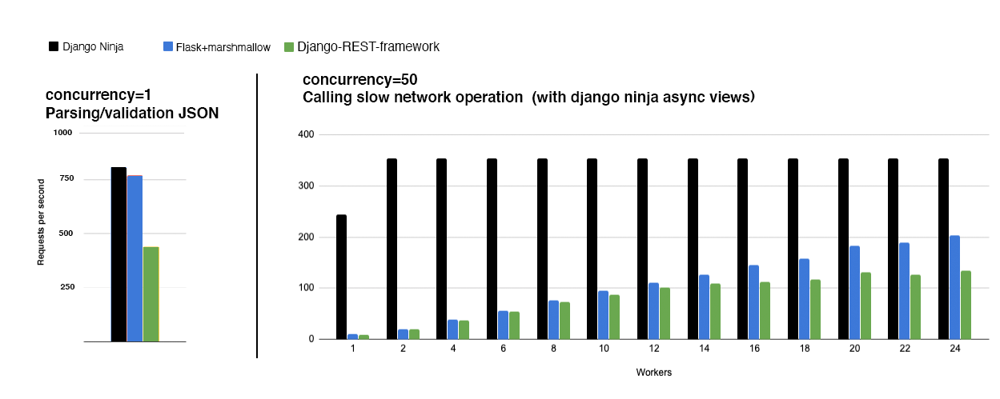
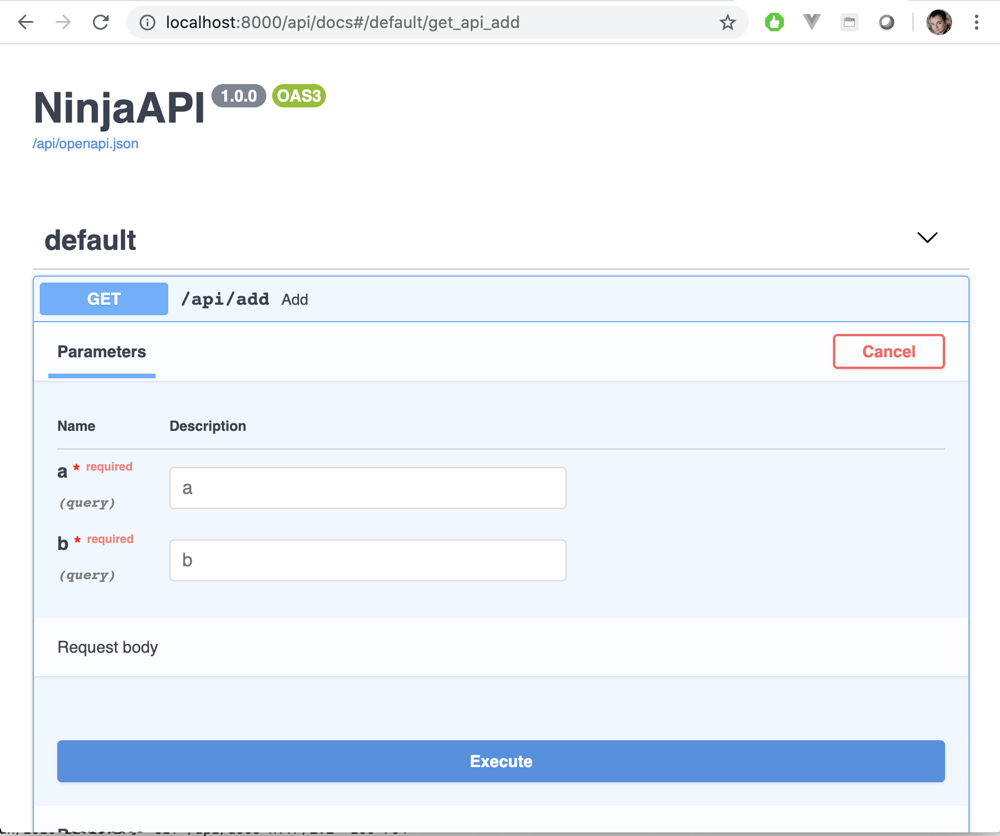

<p align="center">
  <a href="https://django-ninja.rest-framework.com/"></a>
</p>
<p align="center">
    <em>Fast to learn, fast to code, fast to run</em>
</p>


[](https://badge.fury.io/py/django-ninja)

# Django Ninja - Fast Django REST Framework

**Django Ninja** is a web framework for building APIs with **Django** and Python 3.6+ based **type hints**.

**Key features**

 - **Easy**: Designed to be easy to use and intuitive.
 - **Fast**: Very high performance thanks to Pydantic and **<a href="https://django-ninja.rest-framework.com/async-support/">async support</a>**. 
 - **Fast to code**: Type hints and automatic docs let's you focus only on business logic.
 - **Standards-based**: Based on the open standards for APIs: **OpenAPI** (previously known as Swagger) and **JSON Schema**.
 - **Django friendly**: (obviously) have good integration with Django core an ORM.




**Documentation**: https://django-ninja.rest-framework.com

---

## Installation

```
pip install django-ninja
```


## Usage


In your django project next to urls.py create new `api.py` file:

```Python
from ninja import NinjaAPI

api = NinjaAPI()


@api.get("/add")
def add(request, a: int, b: int):
    return {"result": a + b}
```


Now go to `urls.py` and add the following:


```Python hl_lines="3 7"
...
from .api import api

urlpatterns = [
    path("admin/", admin.site.urls),
    path("api/", api.urls),  # <---------- !
]
```

**That's it !**

And you already have:
 - API that receives HTTP GET request at /api/add
 - Takes, validates and type-casts GET parameters `a` and `b`
 - Decodes to JSON operation result
 - Generates an **OpenAPI schema** for defined operation

### Interactive API docs

Now go to <a href="http://127.0.0.1:8000/api/docs" target="_blank">http://127.0.0.1:8000/api/docs</a>

You will see the automatic interactive API documentation (provided by <a href="https://github.com/swagger-api/swagger-ui" target="_blank">Swagger UI</a>):




## Next

 - Read full documentation here - **Documentation**: https://django-ninja.rest-framework.com
 - To support this project - just simply give it a star on github. 
