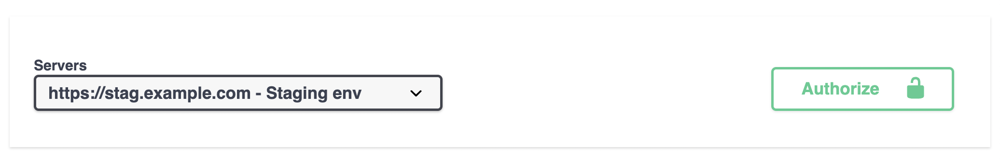

# The NinjaAPI Instance

`NinjaAPI` is the entry point of every project: it holds your configuration (title,
version, auth, renderer...), collects the operations and routers you register on it,
and exposes the `urls` you mount into Django's `urlpatterns`.

```python
from ninja import NinjaAPI

api = NinjaAPI()


@api.get("/hello")
def hello(request):
    return "Hello world"
```

```python hl_lines="6"
from django.contrib import admin
from django.urls import path

urlpatterns = [
    path("admin/", admin.site.urls),
    path("api/", api.urls),
]
```

You don't need to add `ninja` to `INSTALLED_APPS` for this to work — it's only required
if you want Django's staticfiles mechanism to serve the docs UI assets instead of a CDN.

## Constructor options

All arguments are keyword-only.

| Argument | Type | Default | Description |
|---|---|---|---|
| `title` | `str` | `"NinjaAPI"` | Title used in the OpenAPI schema / docs page. |
| `version` | `str` | `"1.0.0"` | API version, also used to build the default `urls_namespace`. |
| `description` | `str` | `""` | Description shown in the OpenAPI schema / docs page. |
| `openapi_url` | `str \| None` | `"/openapi.json"` | Relative URL that serves the OpenAPI schema. `None` disables it (and the docs UI, since it depends on the schema). |
| `docs` | `DocsBase` | `Swagger()` | The docs renderer — `Swagger()` or `Redoc()`. |
| `docs_url` | `str \| None` | `"/docs"` | Relative URL that serves the interactive docs UI. `None` hides the UI while keeping the schema available. |
| `docs_decorator` | `Callable \| None` | `None` | A view decorator applied to the docs view (e.g. to require login). |
| `servers` | `list[dict] \| None` | `None` | List of `{"url": ..., "description": ...}` entries advertised in the OpenAPI schema. |
| `urls_namespace` | `str \| None` | `None` | Django URL namespace for this API. Defaults to `f"api-{version}"`. |
| `auth` | callable, sequence of callables, or `None` | `NOT_SET` | Default authentication for every operation. See [Authentication](authentication.md). |
| `throttle` | throttle instance or list of instances | `NOT_SET` | Default throttling for every operation. See [Throttling](throttling.md). |
| `renderer` | `BaseRenderer \| None` | `JSONRenderer()` | Default response renderer. See [Renderers](renderers.md). |
| `parser` | `Parser \| None` | `Parser()` | Default request body parser. See [Request Parsers](parsers.md). |
| `default_router` | `Router \| None` | `Router()` | The router that operations registered directly on `api` (via `@api.get`, etc.) are added to. |
| `openapi_extra` | `dict \| None` | `None` | Extra keys merged into the top-level OpenAPI schema (e.g. `info.termsOfService`). |

### Title, version and description

```python
api = NinjaAPI(
    title="Demo API",
    version="2.0.0",
    description="A demo API with a versioned schema",
)
```

These three are cosmetic — they only affect the generated OpenAPI schema and the docs
page — with one exception: `version` feeds into the default `urls_namespace` (see below).

### `servers`

Lets you list the hosts your API is deployed to, so the interactive docs can switch
between them:

```python hl_lines="4 5 6 7"
from ninja import NinjaAPI

api = NinjaAPI(
    servers=[
        {"url": "https://stag.example.com", "description": "Staging"},
        {"url": "https://prod.example.com", "description": "Production"},
    ]
)
```



### `docs`, `docs_url` and `docs_decorator`

By default, `NinjaAPI` serves interactive docs built with
[Swagger UI](https://github.com/swagger-api/swagger-ui) at `/docs`. Switch to
[Redoc](https://github.com/Redocly/redoc) with the `docs` argument:

```python
from ninja import NinjaAPI, Redoc

api = NinjaAPI(docs=Redoc())
```

Hide the interactive UI while keeping the schema available for clients or codegen
tools, by setting `docs_url` to `None`:

```python
api = NinjaAPI(docs_url=None)
```

Protect the docs behind Django's own auth, or apply any other view decorator, with
`docs_decorator`:

```python
from django.contrib.admin.views.decorators import staff_member_required

api = NinjaAPI(docs_decorator=staff_member_required)
```

See [OpenAPI & Interactive Docs](openapi.md) for `Swagger`/`Redoc` settings, disabling
the schema entirely with `openapi_url=None`, and writing a custom docs viewer.

### `auth` and `throttle`

`auth` and `throttle` set the **default** for every operation on the API. Any
operation, and any router, can override it — passing `None` explicitly turns the
default off, while leaving the argument out inherits it:

```python
from ninja import NinjaAPI
from ninja.security import django_auth

api = NinjaAPI(auth=django_auth)


@api.get("/protected")
def protected(request):
    ...  # uses django_auth, inherited from the api


@api.get("/public", auth=None)
def public(request):
    ...  # explicitly disables auth for this operation
```

`throttle` works the same way. See [Authentication](authentication.md) and
[Throttling](throttling.md) for the full picture, including how routers fit into the
inheritance chain.

### `renderer` and `parser`

`renderer` controls how responses are serialized (JSON by default); `parser` controls
how the request body is deserialized. Both apply to the whole API:

```python
from ninja import NinjaAPI
from ninja.renderers import BaseRenderer

class ORJSONRenderer(BaseRenderer):
    media_type = "application/json"

    def render(self, request, data, *, response_status):
        import orjson
        return orjson.dumps(data)

api = NinjaAPI(renderer=ORJSONRenderer())
```

See [Renderers](renderers.md) and [Request Parsers](parsers.md).

### `default_router`

Operations declared directly on `api` (`@api.get`, `@api.post`, ...) actually live on
`api.default_router`, a plain `Router()` by default. Pass your own `Router` subclass
to apply its behavior to every top-level operation — for example,
`RouterPaginated`, which paginates every operation whose `response` is a collection:

```python
from ninja import NinjaAPI
from ninja.pagination import RouterPaginated

api = NinjaAPI(default_router=RouterPaginated())


@api.get("/items", response=list[int])
def items(request):
    return list(range(1000))  # automatically paginated
```

### `openapi_extra`

Merges arbitrary extra keys into the generated OpenAPI document, for fields Ninja
doesn't have a dedicated argument for:

```python
api = NinjaAPI(
    title="Demo API",
    openapi_extra={
        "info": {"termsOfService": "https://example.com/terms/"},
    },
)
```

## Registering operations

`api.get()`, `.post()`, `.put()`, `.patch()`, `.delete()` and `.api_operation()` (for
several HTTP methods at once) register a view on `api.default_router`:

```python
@api.get("/items/{item_id}")
def get_item(request, item_id: int):
    return {"item_id": item_id}
```

Each accepts the same set of options (`response`, `summary`, `tags`, `auth`,
`throttle`, `operation_id`, ...) — see [Operations](operations.md) for the full list.

## Adding routers

For anything beyond a handful of endpoints, split your API into `Router`s and mount
them with `add_router()`:

```python
from ninja import NinjaAPI, Router

api = NinjaAPI()
router = Router()


@router.get("/hello")
def hello(request):
    return "Hello world"


api.add_router("/events/", router)
```

`add_router()` also accepts `auth`, `throttle` and `tags` to override the router's own
settings for that particular mount, and `url_name_prefix`, required when the same
router is mounted more than once. See [Routers](routers.md) for nested routers and the
auth/throttle/tags inheritance rules.

!!! warning
    Routers must be added before `api.urls` is accessed (i.e. before Django resolves
    your URLconf). Calling `add_router()` afterwards raises a `ConfigError`.

## Mounting into `urls.py`

`api.urls` is a property returning the `(urlpatterns, app_name, namespace)` tuple
Django's `path()`/`include()` expects, so it's included directly:

```python
from django.urls import path

urlpatterns = [
    path("api/", api.urls),
]
```

## Multiple API instances

A Django project can serve more than one `NinjaAPI`, each mounted at its own prefix —
for example a public and an internal API with different authentication:

```python hl_lines="4 5 10 11"
from ninja import NinjaAPI
from ninja.security import django_auth, django_auth_superuser

api_public = NinjaAPI(auth=django_auth, urls_namespace="public_api")
api_private = NinjaAPI(auth=django_auth_superuser, urls_namespace="private_api")


urlpatterns = [
    ...
    path("api/", api_public.urls),
    path("internal-api/", api_private.urls),
]
```

Each `NinjaAPI` instance needs its own `urls_namespace` — by default it's derived from
`version`, so two instances sharing a `version` (`"1.0.0"` by default) must set either
`version` or `urls_namespace` explicitly, or Django's `reverse()` won't be able to tell
their operations apart.

## Exception handlers

Every `NinjaAPI` instance comes with default handlers for `Exception`, `Http404`,
`HttpError` and Ninja's own `ValidationError`. Register your own with
`add_exception_handler()` or the `@api.exception_handler` decorator:

```python
from ninja import NinjaAPI

api = NinjaAPI()


@api.exception_handler(ZeroDivisionError)
def on_zero_division(request, exc):
    return api.create_response(
        request, {"detail": "Cannot divide by zero"}, status=400
    )
```

See [Errors & Exception Handling](errors.md) for the built-in handlers and more
examples.

## Subclassing NinjaAPI

Two hooks are meant to be overridden by subclassing, when you need custom naming logic
across the whole API rather than per-operation:

```python
from ninja import NinjaAPI


class MyAPI(NinjaAPI):
    def get_openapi_operation_id(self, operation):
        return operation.view_func.__name__

    def get_operation_url_name(self, operation, router):
        return operation.view_func.__name__ + "_v2"


api = MyAPI()
```

`get_openapi_operation_id` sets the `operationId` in the OpenAPI schema for every
operation; `get_operation_url_name` sets the Django URL name used for reverse
resolution when an operation doesn't pass `url_name` explicitly. See
[URLs & Reverse](urls.md) for how the generated names are used with `reverse()`.
