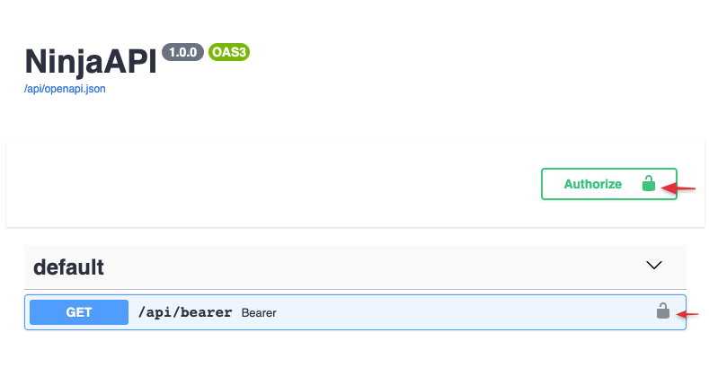
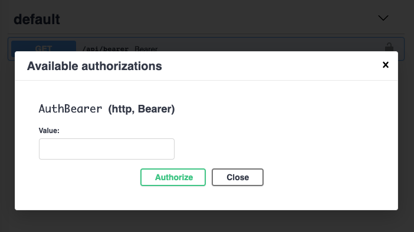

# Authentication

**Django Ninja** lets you attach authentication to an operation, a router, or
the whole API with a single `auth=` argument, without having to hand-roll the
various security schemes yourself.

## Basic usage

Pass `auth=` to an operation decorator. Here, requests are authenticated
using Django's session framework (the default cookie-based login):

```python hl_lines="2 7"
from ninja import NinjaAPI
from ninja.security import django_auth

api = NinjaAPI()


@api.get("/pets", auth=django_auth)
def pets(request):
    return f"Authenticated user {request.auth}"
```

`auth` accepts **any callable** that takes `request` and returns a value:

- If the return value is truthy, it's assigned to `request.auth` and the
  operation runs.
- If it's falsy (or `None`), **Django Ninja** returns an HTTP 401
  `{"detail": "Unauthorized"}` response and the operation never runs.

Everything below — API keys, HTTP Bearer/Basic, sessions — is just a
ready-made class implementing that same protocol, plus a bit of OpenAPI
metadata so the interactive docs know how to prompt for credentials.

## Built-in authenticators

### API key

An API key is a token the client sends with each request to identify
itself — in the query string, a header, or a cookie:

```
GET /something?api_key=abcdef12345           # APIKeyQuery
GET /something HTTP/1.1
X-API-Key: abcdef12345                        # APIKeyHeader
Cookie: api_key=abcdef12345                    # APIKeyCookie
```

Subclass `APIKeyQuery`, `APIKeyHeader` or `APIKeyCookie` (from
`ninja.security`) and implement `authenticate(self, request, key)`,
returning whatever should become `request.auth` (or `None`/falsy to reject):

=== "Query"

    ```python hl_lines="1 6-10"
    from ninja.security import APIKeyQuery

    CLIENTS = {"abcdef12345": "client-1"}


    class ApiKey(APIKeyQuery):
        param_name = "api_key"

        def authenticate(self, request, key):
            return CLIENTS.get(key)


    @api.get("/apikey", auth=ApiKey())
    def apikey(request):
        return f"Hello {request.auth}"
    ```

=== "Header"

    ```python hl_lines="3 6-7 9-11"
    from django.utils.crypto import constant_time_compare

    from ninja.security import APIKeyHeader


    class ApiKey(APIKeyHeader):
        param_name = "X-API-Key"

        def authenticate(self, request, key):
            if constant_time_compare(key, "supersecret"):
                return key


    @api.get("/headerkey", auth=ApiKey())
    def headerkey(request):
        return f"Token = {request.auth}"
    ```

=== "Cookie"

    ```python hl_lines="3 6-9"
    from django.utils.crypto import constant_time_compare

    from ninja.security import APIKeyCookie


    class CookieKey(APIKeyCookie):
        def authenticate(self, request, key):
            if constant_time_compare(key, "supersecret"):
                return key


    @api.get("/cookiekey", auth=CookieKey())
    def cookiekey(request):
        return f"Token = {request.auth}"
    ```

`param_name` is the name of the query parameter, header, or cookie to read
the key from — it defaults to `"key"` on all three classes.

!!! note
    `APIKeyCookie` (and anything built on it, including `django_auth` below)
    also runs a CSRF check by default, since cookies are sent automatically
    by the browser. Pass `csrf=False` to a subclass's `__init__` to disable
    it. See [CSRF](csrf.md) for the full picture.

### HTTP Bearer

Subclass `HttpBearer` and implement `authenticate(self, request, token)`.
The client sends `Authorization: Bearer <token>`:

```python hl_lines="3 6-9"
from django.utils.crypto import constant_time_compare

from ninja.security import HttpBearer


class AuthBearer(HttpBearer):
    def authenticate(self, request, token):
        if constant_time_compare(token, "supersecret"):
            return token


@api.get("/bearer", auth=AuthBearer())
def bearer(request):
    return {"token": request.auth}
```

The `Authorization` header must use the `Bearer` scheme (case-insensitive)
followed by the token; anything else (missing header, wrong scheme, no
token) is treated as unauthenticated rather than an error, so a later
authenticator in a [multiple-authenticators](#multiple-authenticators) list
still gets a chance to run.

### HTTP Basic Auth

Subclass `HttpBasicAuth` and implement
`authenticate(self, request, username, password)`:

```python hl_lines="3 6-9"
from django.utils.crypto import constant_time_compare

from ninja.security import HttpBasicAuth


class BasicAuth(HttpBasicAuth):
    def authenticate(self, request, username, password):
        if constant_time_compare(username, "admin") and constant_time_compare(password, "secret"):
            return username


@api.get("/basic", auth=BasicAuth())
def basic(request):
    return {"httpuser": request.auth}
```

### Django session authentication

`ninja.security` ships three ready-to-use instances built on Django's
session framework (they read the session cookie named by
`settings.SESSION_COOKIE_NAME` and check `request.user`):

| Instance              | Grants access to                        |
| --------------------- | ---------------------------------------- |
| `django_auth`         | any authenticated user                   |
| `django_auth_superuser` | superusers only                        |
| `django_auth_is_staff`  | superusers and staff members            |

```python hl_lines="2 7"
from ninja import NinjaAPI
from ninja.security import django_auth_superuser

api = NinjaAPI()


@api.get("/admin-only", auth=django_auth_superuser)
def admin_view(request):
    return {"message": f"Hello superuser {request.auth}"}
```

Each instance is backed by a class of the same shape —
`SessionAuth`, `SessionAuthSuperUser`, `SessionAuthIsStaff` — in case you
need to subclass one, e.g. to add extra checks.

## Custom function-based authentication

Any plain function works too — **Django Ninja** doesn't require you to
subclass anything. This is handy for one-off checks like an IP allow-list:

```python hl_lines="1-3 6"
def ip_whitelist(request):
    if request.META.get("REMOTE_ADDR") == "8.8.8.8":
        return "8.8.8.8"


@api.get("/ipwhitelist", auth=ip_whitelist)
def ipwhitelist(request):
    return f"Authenticated client, IP = {request.auth}"
```

## Multiple authenticators

Pass a list to `auth=` to accept any one of several schemes. They're tried
in order; the first one to return a truthy value wins, and if none does,
the request is rejected:

```python hl_lines="20"
from django.utils.crypto import constant_time_compare

from ninja.security import APIKeyHeader, APIKeyQuery


class AuthCheck:
    def authenticate(self, request, key):
        if constant_time_compare(key, "supersecret"):
            return key


class QueryKey(AuthCheck, APIKeyQuery):
    pass


class HeaderKey(AuthCheck, APIKeyHeader):
    pass


@api.get("/multiple", auth=[QueryKey(), HeaderKey()])
def multiple(request):
    return f"Token = {request.auth}"
```

## Applying auth at different levels

`auth` can be set on the API, a router, or an individual operation. The most
specific setting wins — an operation's `auth=` overrides its router's, which
overrides the `NinjaAPI`'s:

```python hl_lines="4 9 14"
from ninja import NinjaAPI, Router
from ninja.security import django_auth, HttpBearer

api = NinjaAPI(auth=django_auth)  # applies to every operation by default

router = Router()


@router.get("/public")  # still uses django_auth, inherited from the API
def public(request):
    return {"ok": True}


@router.get("/open", auth=None)  # explicitly disables auth for this operation
def open_endpoint(request):
    return {"ok": True}


api.add_router("/items/", router)
```

A `Router` can set its own default too, either in its constructor or when
mounting it, and that overrides the API-level auth for every operation in
that router:

```python
router = Router(auth=AuthBearer())
# or:
api.add_router("/events/", events_router, auth=AuthBearer())
```

Pass `auth=None` explicitly (on an operation, a router, or when adding a
router) to opt that scope out of whatever auth would otherwise be
inherited — it's the only way to turn auth *off* for part of an API that
sets it globally.

## Authorization and permissions

Authentication identifies who's calling; what they're allowed to do is up
to you. Once authenticated, `request.auth` holds whatever the authenticator
returned (a Django `User` for `django_auth`, a token, an API-key object,
...), so a permission check is just a plain condition on it:

```python hl_lines="9-10"
from ninja import NinjaAPI
from ninja.security import django_auth

api = NinjaAPI(auth=django_auth)


@api.get("/admin")
def admin_view(request):
    if not request.auth.is_staff:
        return api.create_response(request, {"detail": "Forbidden"}, status=403)
    return {"message": "Welcome!"}
```

For a reusable version of this check that you can stack on many operations,
see [Decorators](decorators.md). For the exception-based version
(`raise HttpError(403, ...)` or `AuthorizationError`), see
[Errors & Exception Handling](errors.md).

## Raising exceptions from `authenticate()`

An exception raised inside `authenticate()` is handled the same way as one
raised inside the operation itself — if you've registered a handler for it
with `@api.exception_handler`, that handler builds the response:

```python hl_lines="9 13 22"
from django.utils.crypto import constant_time_compare

from ninja import NinjaAPI
from ninja.security import HttpBearer

api = NinjaAPI()


class InvalidToken(Exception):
    pass


@api.exception_handler(InvalidToken)
def on_invalid_token(request, exc):
    return api.create_response(request, {"detail": "Invalid token supplied"}, status=401)


class AuthBearer(HttpBearer):
    def authenticate(self, request, token):
        if constant_time_compare(token, "supersecret"):
            return token
        raise InvalidToken


@api.get("/bearer", auth=AuthBearer())
def bearer(request):
    return {"token": request.auth}
```

See [Errors & Exception Handling](errors.md) for more on exception handlers.

## Async authentication

Authentication works the same way for async operations, and an
authenticator can itself be async — **Django Ninja** detects an
`async def authenticate` (or an async function passed directly to `auth=`)
and awaits it correctly whether the operation itself is sync or async.

A plain async function:

```python hl_lines="4 8"
from django.utils.crypto import constant_time_compare


async def async_auth(request):
    return constant_time_compare(request.headers.get("X-Token", ""), "supersecret")


@api.get("/pets", auth=async_auth)
async def pets(request):
    return {"user": request.auth}
```

Or an async `authenticate()` method on any of the classes above:

```python hl_lines="6-9"
from django.utils.crypto import constant_time_compare

from ninja.security import HttpBearer


class AsyncBearer(HttpBearer):
    async def authenticate(self, request, token):
        # e.g. an async database or cache lookup
        return token if constant_time_compare(token, "supersecret") else None


@api.get("/async-bearer", auth=AsyncBearer())
async def async_bearer(request):
    return {"token": request.auth}
```

## Interactive docs

Whatever `auth=` an operation uses is reflected in the generated OpenAPI
schema as a security requirement, so the interactive docs at `/api/docs`
show an **Authorize** button for entering credentials:



Clicking it prompts for the right kind of credential for the schemes in
use (a bearer token, an API key, basic-auth credentials, ...):



Once entered, Swagger UI attaches it to every request you try from the
docs page. See [OpenAPI & Interactive Docs](openapi.md) for more.
