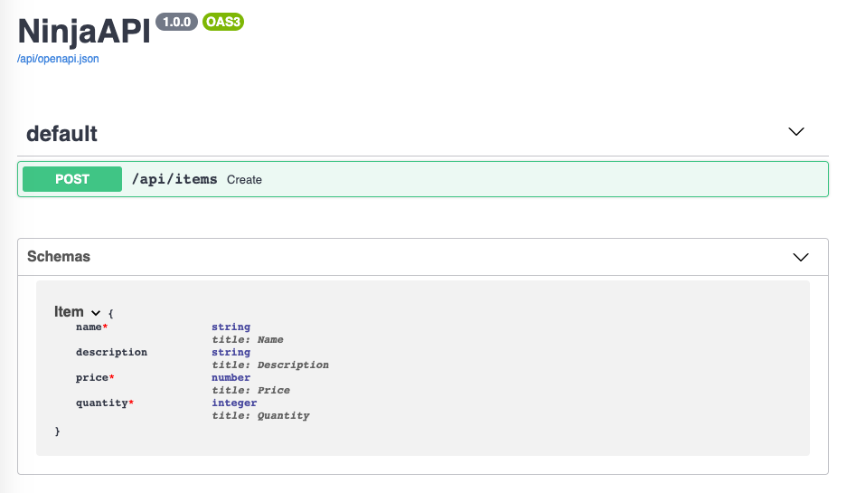
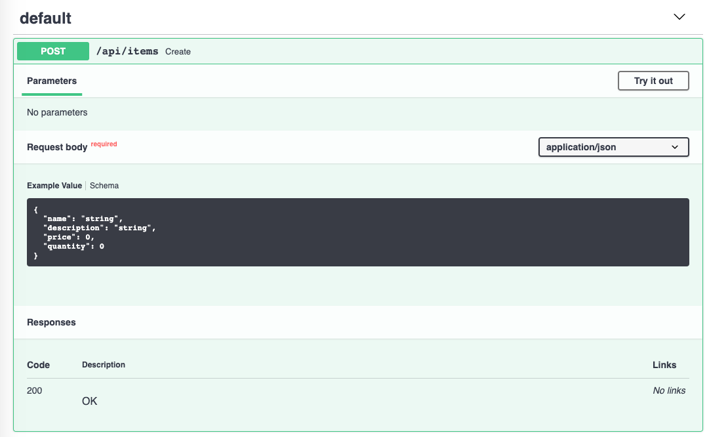
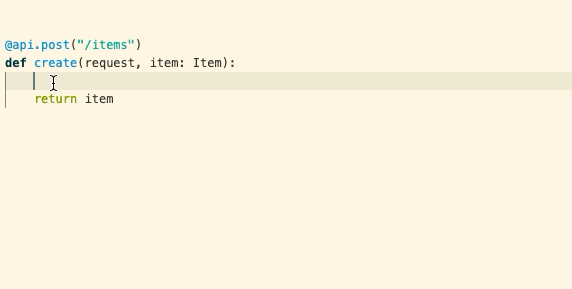

# Request Body

Request bodies are typically used with "create" and "update" operations
(`POST`, `PUT`, `PATCH`) — the payload holds the data for the resource being
created or changed. To declare one, annotate a view argument with a
**`Schema`** subclass; Django Ninja parses the request's JSON body, validates
it, and passes you a fully-typed object.

!!! info "Why `Schema`?"
    Under the hood, `Schema` is a `pydantic.BaseModel` subclass with a few
    Django-friendly additions — see [Schemas](schemas.md). It's named
    `Schema` rather than `Model` specifically to avoid clashing with
    Django's own `django.db.models.Model`.

## Declaring a request body

Define your data shape as a class that inherits from `ninja.Schema`, then use
it as a type hint for a view argument:

```python hl_lines="6-10 14"
from ninja import NinjaAPI, Schema

api = NinjaAPI()


class Item(Schema):
    name: str
    description: str | None = None
    price: float
    quantity: int


@api.post("/items")
def create_item(request, item: Item):
    return item
```

`Item` isn't itself a path or query parameter and isn't a plain scalar type,
so Django Ninja recognizes it as a **body** parameter automatically — there's
no need to wrap it in anything. With just that annotation, Django Ninja will:

* Read the request body and parse it as JSON.
* Convert fields to their declared types, coercing where possible.
* Validate the data, returning a `422` with a precise error if it's invalid.
* Give you the result as `item` — a real `Item` instance, with full editor
  completion for every attribute.
* Add `Item`'s JSON Schema to the generated OpenAPI schema, so it shows up in
  the interactive docs.

See [Schemas](schemas.md) for everything you can do inside a `Schema` class —
nested models, field validators, resolvers, and more.

!!! tip "Content type"
    The default parser reads the request body as JSON regardless of the
    `Content-Type` header. To parse a different wire format (msgpack, ORJSON,
    ...), see [Request Parsers](parsers.md).

## Optional fields and defaults

A field with a default value is optional in the request body. Above,
`description` defaults to `None`, so this JSON is also valid — the response
will contain `"description": null`:

```json
{
    "name": "Katana",
    "price": 299.00,
    "quantity": 10
}
```

Any other field without a default — `name`, `price`, `quantity` — is
required, and a request missing one gets a `422`:

```json
{
    "detail": [
        {
            "type": "missing",
            "loc": ["body", "item", "quantity"],
            "msg": "Field required"
        }
    ]
}
```

## Body + path & query parameters

You can freely mix body arguments with path and query parameters — Django
Ninja looks at each argument on its own and decides where it comes from:

* A name that also appears as a `{placeholder}` in the path is a **path**
  parameter.
* A `Schema` subclass, or a collection type such as `list[...]`, is a **body**
  parameter.
* Anything else — a singular type like `int`, `str`, `float`, `bool`, `UUID`
  — is a **query** parameter.

```python hl_lines="14"
from ninja import NinjaAPI, Schema

api = NinjaAPI()


class Item(Schema):
    name: str
    description: str | None = None
    price: float
    quantity: int


@api.put("/items/{item_id}")
def update_item(request, item_id: int, item: Item, q: str | None = None):
    return {"item_id": item_id, "item": item.dict(), "q": q}
```

Here `item_id` is taken from the path (it matches `{item_id}`), `item` from
the request body (it's a `Schema`), and `q` from the query string (a plain
`str | None`). See [Path Parameters](path-params.md) and
[Query Parameters](query-params.md) for the full rules on each.

## Singular values in the body

A plain scalar argument defaults to a query parameter — to read it from the
body instead, mark it explicitly with `Body`:

```python hl_lines="1 7"
from ninja import Body, NinjaAPI

api = NinjaAPI()


@api.put("/items/{item_id}")
def update_item(request, item_id: int, importance: int = Body(...)):
    return {"item_id": item_id, "importance": importance}
```

`Body` accepts the same validation arguments as
[`Query`](query-params.md#validation-constraints): `gt` / `ge` / `lt` / `le`,
`min_length`, `max_length`, `pattern`, plus `alias`, `title`, `description`,
`example` / `examples`, `deprecated` and `include_in_schema`, and any extra
keyword Pydantic's `Field` understands. The same annotated shortcut used for
path and query params works here too — `importance: Annotated[int,
Body(gt=0)]`, or equivalently `Body[int, P(gt=0)]` using the `P(...)` helper:

```python hl_lines="1 10"
from ninja import NinjaAPI, P, Body

api = NinjaAPI()


@api.post("/items/{item_id}")
def update_item(
    request,
    item_id: int,
    importance: Body[int, P(gt=0)],
):
    return {"item_id": item_id, "importance": importance}
```

!!! warning "A lone scalar body parameter isn't wrapped in an object"
    `importance` is the *only* body-sourced argument in this view, so the
    request body must be the bare value itself — just `5`, not
    `{"importance": 5}`. Sending `{"importance": 5}` here raises a `422`
    ("Input should be a valid integer"), because that object is validated
    *as* the integer. Once you add a second body parameter, this stops
    applying — see the next section.

## Multiple body parameters

As soon as a view declares **more than one** body-sourced argument — whether
that's several schemas, or a schema plus a singular `Body(...)` value like
`importance` above — Django Ninja stops treating the whole JSON body as a
single value. Instead, it expects each argument's data **nested under a key
matching its parameter name** (or its `alias`, if you gave it one):

```python hl_lines="6-8 11-12 16"
from ninja import NinjaAPI, Schema

api = NinjaAPI()


class Item(Schema):
    name: str
    price: float


class User(Schema):
    username: str


@api.post("/items/{item_id}")
def update_item(request, item_id: int, item: Item, user: User):
    return {"item_id": item_id, "item": item.dict(), "user": user.dict()}
```

The request body must now look like:

```json
{
    "item": {"name": "Katana", "price": 299.00},
    "user": {"username": "vitaliy"}
}
```

!!! note "Single vs. multiple body parameters"
    With a single body parameter (as in the earlier examples), the request
    body *is* that value directly — there's no wrapping key. It's only once a
    second body-sourced argument appears that every body parameter gets
    embedded under its own key, singular values included.

!!! tip "Validation error paths with a single body parameter"
    Even with a single body parameter, its argument name shows up as an extra
    segment in validation error paths. Given `def create(request, payload:
    UserIn)`, an invalid `email` field reports
    `"loc": ["body", "payload", "email"]` — not `["body", "email"]` — because
    the argument name is part of how Django Ninja resolves the field
    internally.

## Lists in the request body

A bare collection type, without any explicit marker, is treated as a body
parameter — the request body is a JSON array:

```python hl_lines="12"
from ninja import NinjaAPI, Schema

api = NinjaAPI()


class Item(Schema):
    name: str
    price: float


@api.post("/items/bulk")
def create_items(request, items: list[Item]):
    return {"count": len(items)}
```

!!! warning
    This is the opposite of what happens for singular types: a plain `int` or
    `str` argument defaults to a **query** parameter, but a plain `list[int]`
    or `list[Item]` defaults to a **body** parameter. To read a list from the
    query string instead, annotate it explicitly with
    [`Query`](query-params.md#multiple-values-lists).

`Body(...)` itself accepts `min_length` and `max_length`, so you can
constrain a list body directly without wrapping it in a `Schema`:

```python hl_lines="7"
from ninja import Body, NinjaAPI

api = NinjaAPI()


@api.post("/tags")
def create_tags(request, tags: list[str] = Body(..., min_length=1)):
    return {"tags": tags}
```

## Partial updates with `PatchDict`

For a `PATCH` view, you usually want only the fields the client actually
sent — leaving the rest of the object untouched. `PatchDict[Schema]` makes
every field of `Schema` optional and gives you back a plain `dict` containing
only the fields that were present in the request:

```python hl_lines="6-10 17"
from ninja import NinjaAPI, PatchDict, Schema

api = NinjaAPI()


class ItemPatch(Schema):
    name: str
    description: str | None = None
    price: float
    quantity: int


items_db = {1: {"name": "Katana", "description": None, "price": 299.0, "quantity": 10}}


@api.patch("/items/{item_id}")
def patch_item(request, item_id: int, payload: PatchDict[ItemPatch]):
    items_db[item_id].update(payload)
    return {"item_id": item_id, "updated": list(payload.keys())}
```

You don't need to make the fields on `ItemPatch` optional yourself —
`PatchDict` does that for you, and the fields stay required on any other view
that uses the same schema for a full `POST` or `PUT`.

A request with `{"price": 250.00}` produces `payload == {"price": 250.0}` —
only the field that was actually sent — regardless of how many fields
`ItemPatch` declares.

## Automatic docs and editor support

The JSON Schema for every body parameter is included in the generated OpenAPI
schema, and shown in the interactive docs for each operation that uses it:





Because the body argument is a real `Item` instance rather than a plain
`dict`, your editor gives you completion and type checking for its attributes
throughout the view:


