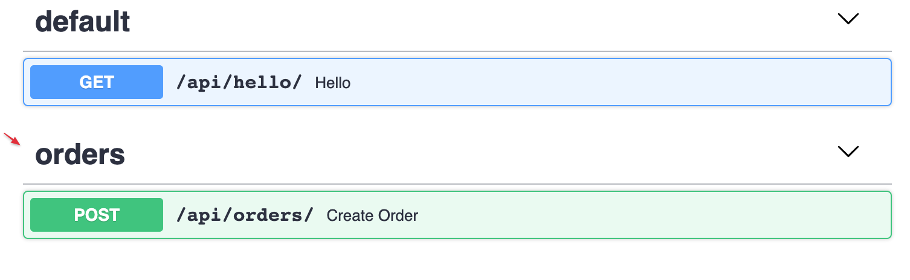
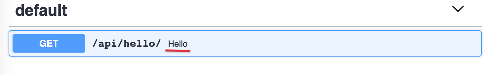
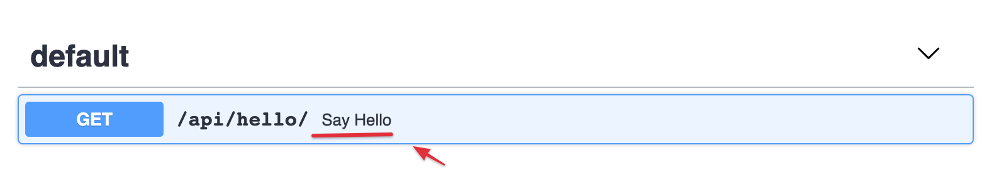
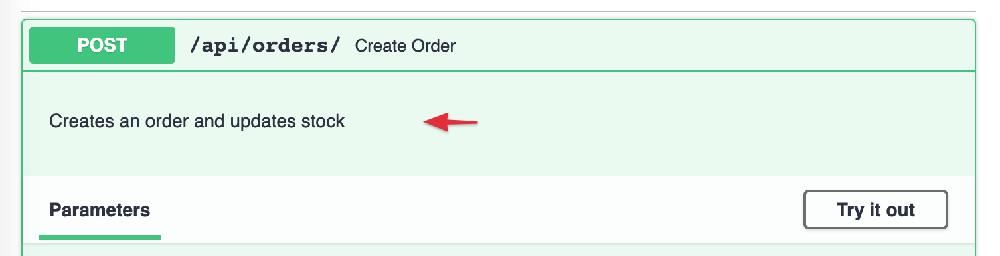
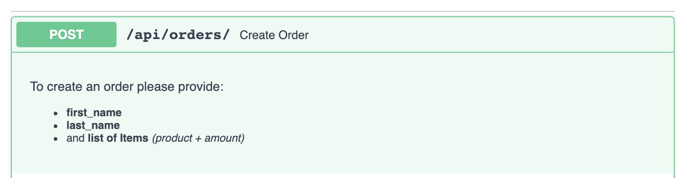
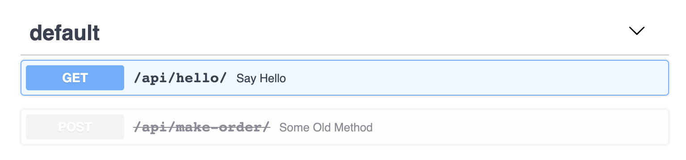

# Operations

An **operation** is a Python function bound to a URL path and one or more HTTP
methods. You declare one by decorating a view function on a `NinjaAPI` instance
(or a [`Router`](routers.md)) with `@api.get`, `@api.post`, and friends.

## Defining operations

**Django Ninja** has a decorator for each of the standard HTTP methods:

```python hl_lines="6 11 16 21 26"
from ninja import NinjaAPI

api = NinjaAPI()


@api.get("/hello")
def get_hello(request):
    return {"message": "hello"}


@api.post("/hello")
def post_hello(request):
    return {"message": "hello"}


@api.put("/hello/{id}")
def put_hello(request, id: int):
    return {"message": "hello"}


@api.patch("/hello/{id}")
def patch_hello(request, id: int):
    return {"message": "hello"}


@api.delete("/hello/{id}")
def delete_hello(request, id: int):
    return {"message": "hello"}
```

The same decorators are available on a `Router`, so everything on this page applies
whether you register operations directly on `api` or on a router mounted with
`add_router`.

## Handling multiple methods

To handle several methods with a single function, use `api_operation`:

```python hl_lines="6"
from ninja import NinjaAPI

api = NinjaAPI()


@api.api_operation(["POST", "PATCH"], "/tasks/{task_id}")
def upsert_task(request, task_id: int):
    return {"task_id": task_id}
```

This is also how you implement methods that don't have their own shortcut
decorator, such as `HEAD` or `OPTIONS`:

```python hl_lines="6"
from ninja import NinjaAPI

api = NinjaAPI()


@api.api_operation(["HEAD", "OPTIONS"], "/tasks")
def tasks_meta(request):
    return {}
```

## Sync vs async

Any operation can be declared with `def` or `async def` — **Django Ninja** detects
this automatically and calls the view accordingly:

=== "Sync"

    ```python
    @api.get("/hello")
    def hello(request):
        return {"message": "hello"}
    ```

=== "Async"

    ```python
    @api.get("/hello")
    async def hello(request):
        return {"message": "hello"}
    ```

You can freely mix sync and async operations on the same API or router. See
[Async Support](async.md) for the details on running under ASGI and calling async
code from your views.

## Operation options

Every operation decorator (`get`, `post`, `put`, `patch`, `delete`, `api_operation`)
accepts the same set of keyword-only arguments, on top of `path`:

| Argument | Type | Default | Description |
|---|---|---|---|
| `response` | schema, or `dict[int, schema]` | not set (returned value is serialized as-is) | Validates and serializes the return value. See [Responses](responses.md). |
| `operation_id` | `str \| None` | auto-generated | Unique OpenAPI `operationId` for this operation. |
| `summary` | `str \| None` | auto-generated from the function name | Short, human-readable name shown in the docs UI. |
| `description` | `str \| None` | the function's docstring | Longer explanation shown in the docs UI. |
| `tags` | `list[str] \| None` | inherited from the router | Groups operations together in the docs UI. |
| `deprecated` | `bool \| None` | `None` (`False`) | Marks the operation as deprecated in the schema and docs UI. |
| `by_alias` | `bool \| None` | `None` (`False`) | Serialize response fields using their alias instead of their Python name. |
| `exclude_unset` | `bool \| None` | `None` (`False`) | Omit response fields that were never explicitly set. |
| `exclude_defaults` | `bool \| None` | `None` (`False`) | Omit response fields equal to their default value. |
| `exclude_none` | `bool \| None` | `None` (`False`) | Omit response fields whose value is `None`. |
| `url_name` | `str \| None` | the view function's name | Name used to `reverse()` this operation's URL. See [URLs & Reverse](urls.md). |
| `include_in_schema` | `bool` | `True` | Excludes the operation from the OpenAPI schema (and docs UI) when `False`. |
| `openapi_extra` | `dict \| None` | `None` | Extra keys merged into this operation's OpenAPI entry. |

They also accept `auth` and `throttle`, which override the API/router defaults for
that single operation — see [Authentication](authentication.md) and
[Throttling](throttling.md).

### `tags`

```python hl_lines="6"
@api.get("/hello/")
def hello(request, name: str):
    return {"hello": name}


@api.post("/orders/", tags=["orders"])
def create_order(request, order: str):
    return {"success": True}
```

Tools that render the schema may group operations by tag — Swagger UI, for example,
uses them to build its collapsible sections:



#### Tags on a whole router

Instead of tagging every operation individually, tag them all at once, either on the
`Router` itself or when mounting it:

```python
from ninja import Router

router = Router(tags=["events"])

# or, override it for a particular mount:
api.add_router("/events/", router, tags=["events"])
```

An operation's own `tags` argument always takes priority over the router's. See
[Routers](routers.md) for more on router-level configuration.

### `summary`

By default, the summary is generated by title-casing the function name:

```python hl_lines="2"
@api.get("/hello/")
def hello(request, name: str):
    return {"hello": name}
```



Pass `summary` to override it (handy for a nicer name, or a translation):

```python hl_lines="1"
@api.get("/hello/", summary="Say Hello")
def hello(request, name: str):
    return {"hello": name}
```



### `description`

Use `description`, or a plain docstring, to explain what the operation does:

```python hl_lines="1"
@api.post("/orders/", description="Creates an order and updates stock")
def create_order(request, order: str):
    return {"success": True}
```



A docstring is convenient for a longer, multi-line description — including simple
Markdown, which the docs UI renders:

```python hl_lines="3 4 5 6 7 8"
@api.post("/orders/")
def create_order(request, order: str):
    """
    To create an order please provide:
     - **first_name**
     - **last_name**
     - and **list of Items** *(product + amount)*
    """
    return {"success": True}
```



### `operation_id`

The OpenAPI `operationId` is an optional unique string identifying an operation —
when set, it must be unique across the whole schema. By default, **Django Ninja**
builds it from the view's module and function name.

Set it explicitly per operation:

```python hl_lines="1"
@api.post("/tasks", operation_id="create_task")
def new_task(request):
    ...
```

Or override the naming logic for the whole API by subclassing `NinjaAPI` and
overriding `get_openapi_operation_id`:

```python hl_lines="5 6 8"
from ninja import NinjaAPI
from ninja.operation import Operation


class MySuperApi(NinjaAPI):
    def get_openapi_operation_id(self, operation: Operation) -> str:
        # operation gives you .path, .view_func, .methods, etc.
        return operation.view_func.__name__


api = MySuperApi()
```

### `deprecated`

Mark an operation as deprecated without removing it:

```python hl_lines="1"
@api.post("/make-order/", deprecated=True)
def some_old_method(request, order: str):
    return {"success": True}
```

It's flagged as deprecated in both the JSON schema and the interactive docs:



### `include_in_schema`

Hide an operation from the OpenAPI schema (and therefore the docs UI) while keeping
it fully functional — useful for internal or health-check endpoints:

```python hl_lines="1"
@api.post("/hidden", include_in_schema=False)
def some_hidden_operation(request):
    pass
```

### `openapi_extra`

For anything the other options don't cover, merge arbitrary keys straight into the
operation's [OpenAPI entry](https://swagger.io/docs/specification/about/) with
`openapi_extra`. For example, to describe a request body that isn't backed by a
schema:

```python hl_lines="1 3"
@api.get(
    "/tasks",
    openapi_extra={
        "requestBody": {
            "content": {
                "application/json": {
                    "schema": {
                        "required": ["email"],
                        "type": "object",
                        "properties": {
                            "name": {"type": "string"},
                            "phone": {"type": "number"},
                            "email": {"type": "string"},
                        },
                    }
                }
            },
            "required": True,
        }
    },
)
def some_operation(request):
    pass
```

Or to document extra responses beyond the ones generated automatically:

```python hl_lines="1 4 5 6"
@api.post(
    "/tasks",
    openapi_extra={
        "responses": {
            400: {"description": "Error Response"},
            404: {"description": "Not Found Response"},
        },
    },
)
def some_operation_2(request):
    pass
```

### `by_alias`, `exclude_unset`, `exclude_defaults`, `exclude_none`

These four map directly onto the underlying Pydantic `model_dump()` call used to
serialize your response, letting you tune the output per operation:

```python hl_lines="6 10"
from ninja import Schema
from pydantic import Field


class UserOut(Schema):
    name: str = Field(alias="userName")
    nickname: str | None = None


@api.get("/users/{user_id}", response=UserOut, by_alias=True, exclude_none=True)
def get_user(request, user_id: int):
    return UserOut(userName="John", nickname=None)
```

Here the response is keyed by `userName` instead of `name` (`by_alias=True`), and
`nickname` is dropped entirely since it's `None` (`exclude_none=True`).

All four default to `False`. They can also be set once on a `Router(...)` to apply
to every operation registered on it, unless an operation overrides them explicitly.

!!! tip
    These are output-serialization switches, not validation rules — they only
    affect what ends up in the response body. For everything else about shaping
    responses (multiple status codes, returning a plain `HttpResponse`, streaming,
    etc.), see [Responses](responses.md).
