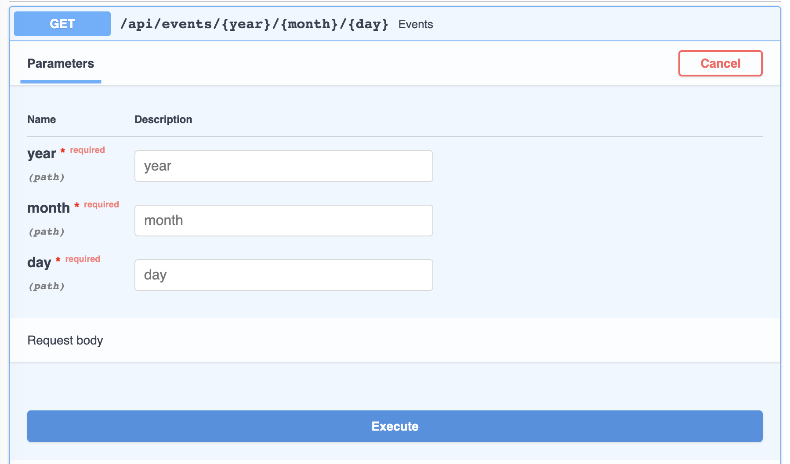

# Path Parameters

You declare path parameters using the same `{...}` syntax as Python format
strings — which conveniently also matches how
[OpenAPI describes path parameters](https://swagger.io/docs/specification/describing-parameters/#path-parameters).
**Django Ninja** reads your view's type hints to parse, validate and document
each one automatically.

## Declaring a path parameter

Add a `{name}` placeholder to the path and a matching argument to your function:

```python hl_lines="1 2"
@api.get("/items/{item_id}")
def read_item(request, item_id):
    return {"item_id": item_id}
```

The value captured from the URL is passed to your function as `item_id`. A
request to `/items/foo` returns:

```json
{"item_id": "foo"}
```

Since `item_id` has no type annotation, it defaults to `str`.

## Type conversion and validation

Annotate the argument with a standard Python type to get automatic parsing and
validation:

```python hl_lines="2"
@api.get("/items/{item_id}")
def read_item(request, item_id: int):
    return {"item_id": item_id}
```

A request to `/items/3` now returns `{"item_id": 3}` — a Python `int`, not the
string `"3"`.

If the value can't be converted, **Django Ninja** returns a `422` error
describing the problem instead of calling your view:

```json
{
    "detail": [
        {
            "type": "int_parsing",
            "loc": ["path", "item_id"],
            "msg": "Input should be a valid integer, unable to parse string as an integer"
        }
    ]
}
```

!!! note "Path parameters are always required"
    Because a path parameter is part of the URL, it can't have a default
    value — declaring one raises an error when the app starts. If a field is
    genuinely optional, make it a [query parameter](query-params.md) instead.

## Django path converters

You can also use [Django's path converters](https://docs.djangoproject.com/en/stable/topics/http/urls/#path-converters)
directly in the path — `str`, `int`, `slug`, `uuid` and `path`:

```python hl_lines="1"
@api.get("/items/{int:item_id}")
def read_item(request, item_id):
    return {"item_id": item_id}
```

With a converter, Django itself rejects non-matching URLs before your view is
even reached — if `item_id` isn't a valid `int`, the route doesn't match at
all (resulting in a `404`, or a `422` from another matching route) rather than
returning a validation error.

!!! tip
    A converter narrows which URLs match, but doesn't change the argument's
    Python type by itself — an unannotated argument is still treated as
    `str`. Since the `int` converter has already turned the value into a
    Python `int` before **Django Ninja** sees it, that mismatch fails
    validation with a `422` error instead of calling your view. Annotate the
    argument to match the converter:

    ```python hl_lines="2"
    @api.get("/items/{int:item_id}")
    def read_item(request, item_id: int):
        return {"item_id": item_id}
    ```

!!! note "The `uuid` converter"
    Django's built-in `uuid` converter normally returns a `UUID` object.
    **Django Ninja** rewrites `{uuid:...}` to a custom `{uuidstr:...}`
    converter under the hood, so your view always receives a plain `str` and
    lets Pydantic (or your own annotation) handle any further conversion.

### Path parameters with slashes

The `path` converter matches the rest of the URL, slashes included:

```python hl_lines="1"
@api.get("/dir/{path:value}")
def read_path(request, value: str):
    return value
```

A request to `/dir/some/path/with-slashes` returns `value` equal to
`"some/path/with-slashes"`.

## Multiple parameters

Declare as many path parameters as you need — just give each one a unique
name that also appears in the function signature:

```python
@api.get("/events/{year}/{month}/{day}")
def events(request, year: int, month: int, day: int):
    return {"date": [year, month, day]}
```

## Extra validation with `Path`

For constraints beyond a plain type — numeric ranges, string length, a regex
pattern — annotate the argument with `ninja.Path(...)` instead of (or in
addition to) a type:

```python hl_lines="1 7"
from ninja import NinjaAPI, Path

api = NinjaAPI()


@api.get("/items/{item_id}")
def read_item(request, item_id: int = Path(..., gt=0, le=1000)):
    return {"item_id": item_id}
```

`Path` accepts the same options as [`Query`](query-params.md): `alias`,
`title`, `description`, `gt` / `ge` / `lt` / `le`, `min_length`, `max_length`,
`pattern`, `example`, `examples`, `deprecated` and `include_in_schema`, plus
any extra keyword Pydantic's `Field` understands.

## Grouping parameters in a schema

When several path parameters belong together — and especially when they need
to be validated as a group — encapsulate them in a `Schema` and annotate the
argument with `Path[...]`:

```python hl_lines="3 8 9 10 11 12 13 14 18"
import datetime

from ninja import NinjaAPI, Path, Schema

api = NinjaAPI()


class EventDate(Schema):
    year: int
    month: int
    day: int

    def value(self) -> datetime.date:
        return datetime.date(self.year, self.month, self.day)


@api.get("/events/{year}/{month}/{day}")
def events(request, date: Path[EventDate]):
    return {"date": date.value()}
```

Every field on the schema must correspond to a `{placeholder}` in the path —
**Django Ninja** warns at startup if any path placeholder has no matching
field.

!!! note
    Nested path parameters work the same way as [nested query
    parameters](query-params.md) — a schema field can itself be another
    `Schema`, as long as every leaf field maps back to a name in the path.

## Path parameters from a router prefix

A [`Router`](routers.md) mounted under a prefix that contains its own
`{placeholders}` can read them the same way, even though they aren't part of
the operation's own path string:

```python hl_lines="8"
from ninja import NinjaAPI, Path, Router

api = NinjaAPI()
router = Router()


@router.get("/multiply/{c}")
def multiply(request, c: int, a: int = Path(...), b: int = Path(...)):
    return {"result": (a + b) * c}


api.add_router("add/{a}/{b}", router)
```

Here `a` and `b` come from the router's mount prefix (`add/{a}/{b}`), not from
`/multiply/{c}` itself. See [Nested URL parameters](routers.md#nested-url-parameters)
for the full example.

## Interactive docs

Path parameters show up in the interactive docs with their type and any
validation you've declared:


