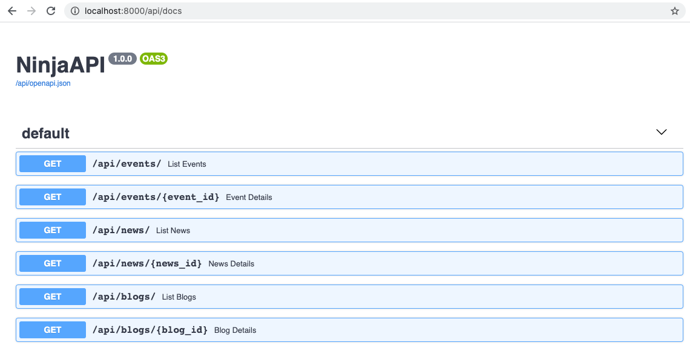
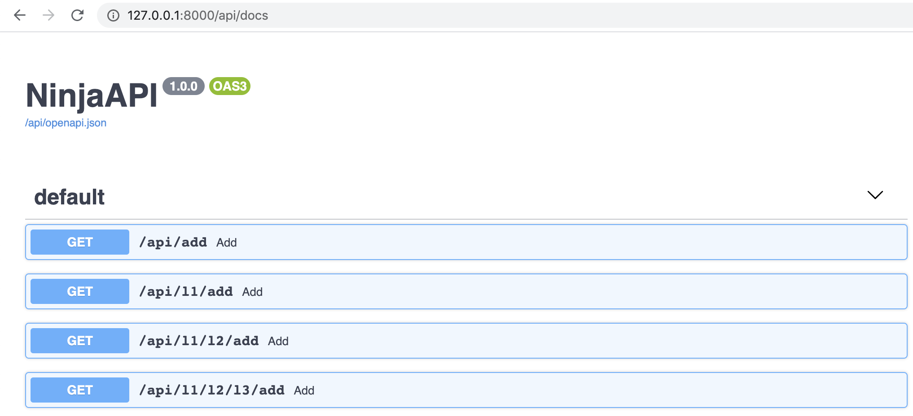

# Routers

A real application rarely fits into a single file. `Router` lets you split your API
into modules — typically one per Django app — and combine them under a single
`NinjaAPI` instance.

## Basic usage

A typical layout has one `Router` per Django app, each in its own `api.py`, plus a
project-level `api.py` that combines them:

```
myproject/
├── api.py
└── settings.py
events/
├── api.py
└── models.py
news/
├── api.py
└── models.py
blogs/
├── api.py
└── models.py
manage.py
```

Instead of registering operations on the `NinjaAPI` instance directly, register them
on a `Router`:

```python
# events/api.py
from ninja import Router
from .models import Event

router = Router()


@router.get("/")
def list_events(request):
    return [{"id": e.id, "title": e.title} for e in Event.objects.all()]


@router.get("/{event_id}")
def event_details(request, event_id: int):
    event = Event.objects.get(id=event_id)
    return {"title": event.title, "details": event.details}
```

`news/api.py` and `blogs/api.py` follow the same pattern. `Router` supports the same
`.get()`, `.post()`, `.put()`, `.patch()`, `.delete()` and `.api_operation()` methods
as `NinjaAPI` — see [Operations](operations.md) for the full set of options each one
takes.

Then, in your project-level `api.py`, import the routers and mount each one with
`add_router()`:

```python hl_lines="2 6 7 8"
from ninja import NinjaAPI
from events.api import router as events_router

api = NinjaAPI()

api.add_router("/events/", events_router)      # by object
api.add_router("/news/", "news.api.router")    # or by Python import path
api.add_router("/blogs/", "blogs.api.router")
```

Passing a dotted string instead of the object itself avoids importing the app's `api`
module (and therefore its models) at the top of your project's `api.py` — handy for
avoiding circular imports.

Everything registered on `events_router` now lives under `/api/events/`. Open
`/api/docs` and all three routers show up combined into a single schema:



## `Router` constructor options

All arguments are keyword-only, and each one is a *default* that individual
operations can override:

| Argument | Type | Default | Description |
|---|---|---|---|
| `auth` | callable, sequence of callables, or `None` | `NOT_SET` | Default authentication for every operation in this router. See [Authentication](authentication.md). |
| `throttle` | throttle instance or list of instances | `NOT_SET` | Default throttling for every operation in this router. See [Throttling](throttling.md). |
| `tags` | `list[str] \| None` | `None` | Default OpenAPI tags for every operation in this router. |
| `by_alias` | `bool \| None` | `None` | Default `by_alias` for response serialization. See [Schema Configuration](schema-config.md). |
| `exclude_unset` | `bool \| None` | `None` | Default `exclude_unset` for response serialization. |
| `exclude_defaults` | `bool \| None` | `None` | Default `exclude_defaults` for response serialization. |
| `exclude_none` | `bool \| None` | `None` | Default `exclude_none` for response serialization. |

## Router-level authentication

Apply an authenticator to every operation in a router, either on the constructor:

```python
from ninja import Router
from ninja.security import django_auth

router = Router(auth=django_auth)
```

or when mounting it:

```python
api.add_router("/events/", events_router, auth=django_auth)
```

The effective auth for an operation is resolved with this priority: the operation's
own `auth=` argument, then the `auth` passed to `add_router()`, then the `Router`'s
own `auth`, then whatever the router inherited from a parent router (see
[Nested routers](#nested-routers) below), and finally `NinjaAPI(auth=...)`.

Throttling works the same way — `Router(throttle=...)` or
`add_router(..., throttle=...)` — with the same override priority. See
[Throttling](throttling.md).

## Router tags

Set a default OpenAPI tag for every operation declared on a router:

```python
router = Router(tags=["events"])
```

or override it for a specific mount:

```python
api.add_router("/events/", events_router, tags=["events"])
```

Tags passed to `add_router()` **replace** the router's own tags for that mount rather
than merging with them. Tags set on the `Router` itself, on the other hand,
accumulate with tags inherited from a parent router when the router is nested. An
operation's own `tags=` argument always wins over both.

## Nested routers

A `Router` can mount another `Router`, exactly like an API does, letting you split
logic into as many levels as you need. Call `add_router()` on the router instance
instead of the `api` instance, then mount the top-level router into `api` as usual:

```python hl_lines="5 6 7 30 31 32"
from ninja import NinjaAPI, Router

api = NinjaAPI()

first_router = Router()
second_router = Router()
third_router = Router()


@api.get("/add")
def add(request, a: int, b: int):
    return {"result": a + b}


@first_router.get("/add")
def add(request, a: int, b: int):
    return {"result": a + b}


@second_router.get("/add")
def add(request, a: int, b: int):
    return {"result": a + b}


@third_router.get("/add")
def add(request, a: int, b: int):
    return {"result": a + b}


second_router.add_router("l3", third_router)
first_router.add_router("l2", second_router)
api.add_router("l1", first_router)
```

This produces:

```
/api/add
/api/l1/add
/api/l1/l2/add
/api/l1/l2/l3/add
```

`auth`, `throttle` and `tags` set on a parent router flow down to every router
nested inside it, unless a child router (or an individual operation) overrides them.



### Nested URL parameters

Path parameters from the parent's mount prefix are available to operations in the
nested router by declaring them with [`Path`](path-params.md):

```python hl_lines="12 13"
from ninja import NinjaAPI, Path, Router

api = NinjaAPI()
router = Router()


@api.get("/add/{a}/{b}")
def add(request, a: int, b: int):
    return {"result": a + b}


@router.get("/multiply/{c}")
def multiply(request, c: int, a: int = Path(...), b: int = Path(...)):
    return {"result": (a + b) * c}


api.add_router("add/{a}/{b}", router)
```

which generates:

```
/api/add/{a}/{b}
/api/add/{a}/{b}/multiply/{c}
```

## Mounting the same router twice

Mounting the same `Router` instance more than once raises a `ConfigError` unless
each extra mount gets a unique `url_name_prefix`, since operation `url_name`s must
be unique within a Django URL namespace:

```python
api.add_router("/v1/things/", things_router)
api.add_router("/v2/things/", things_router, url_name_prefix="things_v2")
```

See [URLs & Reverse](urls.md) for how `url_name` and namespaces work.

## Decorators

`router.add_decorator()` wraps every operation in the router with a plain Python
decorator, without changing its signature checks. See [Decorators](decorators.md).

## Auto-paginated routers

`RouterPaginated`, from `ninja.pagination`, is a `Router` subclass that automatically
applies your default pagination class to every operation whose `response` is a
collection type (e.g. `response=list[Something]`), so you don't need `@paginate` on
each one. See [Pagination](pagination.md) for details and configuration.

## Tips

- Each mount clones the router's operations, so the same `Router` instance can be
  mounted more than once (with a distinct `url_name_prefix` per extra mount) without
  the mounts affecting each other.
- Routers freeze the first time Django needs their URL patterns — in practice, the
  first time `api.urls` is accessed. Add all operations and call every `add_router()`
  before that point; adding to a frozen router raises `ConfigError`.
- `default_router` on `NinjaAPI` is just the `Router` that `@api.get()` and friends
  register onto — pass your own (e.g. a `RouterPaginated()`) to
  `NinjaAPI(default_router=...)` to make every directly-registered operation
  paginated by default.
