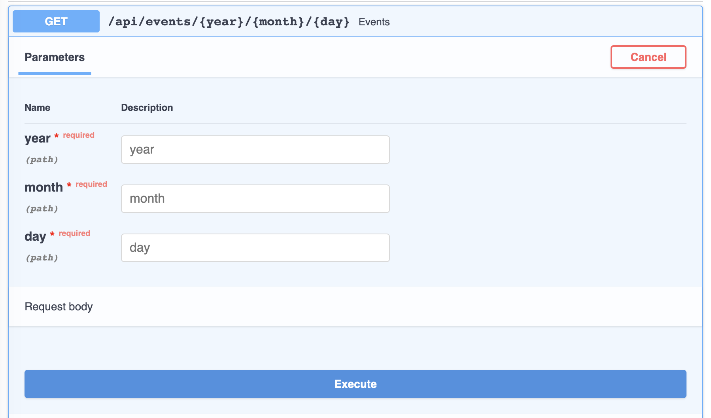

# Path parameters
You can declare path "parameters" with the same syntax used by Python format-strings (which luckily also matches the <a href="https://swagger.io/docs/specification/describing-parameters/#path-parameters" target="_blank">OpenAPI path parameters</a>):

```python hl_lines="1 2"
{!./src/tutorial/path/code01.py!}
```

The value of the path parameter `item_id` will be passed to your function as the argument `item_id`.

So, if you run this example and go to <a href="http://localhost:8000/api/items/foo" target="_blank">http://localhost:8000/api/items/foo</a>, you will see this response:

```JSON
{"item_id":"foo"}
```


### Path parameters with types
You can declare the type of path parameter in the function using standard Python type annotations:

```python hl_lines="2"
{!./src/tutorial/path/code02.py!}
```

In this case,`item_id` is declared to be an **`int`**. This will give you editor and linter support for error checks, completion, etc.

If you run this in your browser with <a href="http://localhost:8000/api/items/3" target="_blank">http://localhost:8000/api/items/3</a>, you will see this response:
```JSON
{"item_id":3}
```

!!! tip
    Notice that the value your function received (and returned) is **3**, as a Python `int` - not a string `"3"`.
    So, with just that type declaration, **Django Ninja** gives you automatic request "parsing" and validation.


### Data validation
On the other hand, if you go to the browser at <a href="http://localhost:8000/api/items/foo" target="_blank">http://localhost:8000/api/items/foo</a> <small>*(`"foo"` is not int)*</small>, you will see an HTTP error like this:

```JSON hl_lines="8"
{
    "detail": [
        {
            "loc": [
                "path",
                "item_id"
            ],
            "msg": "value is not a valid integer",
            "type": "type_error.integer"
        }
    ]
}
```


### Django Path Converters

You can use [Django Path Converters](https://docs.djangoproject.com/en/stable/topics/http/urls/#path-converters)
to help parse the path:

```python hl_lines="1"
@api.get("/items/{int:item_id}")
def read_item(request, item_id):
    return {"item_id": item_id}
```

In this case,`item_id` will be parsed as an **`int`**. If `item_id` is not a valid `int`, the url will not
match.  (e.g. if no other path matches, a *404 Not Found* will be returned)

!!! tip
    Notice that, since **Django Ninja** uses a default type of `str` for unannotated parameters, the value the
    function above received (and returned) is `"3"`, as a Python `str` - not an integer **3**. To receive
    an `int`, simply declare `item_id` as an `int` type annotation in the function definition as normal:

    ```python hl_lines="2"
    @api.get("/items/{int:item_id}")
    def read_item(request, item_id:int):
        return {"item_id": item_id}
    ```
 
#### Path params with slashes

Django's `path` converter allows you to handle path-like parameters:

```python hl_lines="1"
@api.get('/dir/{path:value}')
def someview(request, value: str):
    return value
```
you can query this operation with `/dir/some/path/with-slashes` and your `value` will be equal to `some/path/with-slashes`

### Multiple parameters

You can pass as many variables as you want into `path`, just remember to have unique names and don't forget to use the same names in the function arguments.

```python
@api.get("/events/{year}/{month}/{day}")
def events(request, year: int, month: int, day: int):
    return {"date": [year, month, day]}
```


### Using Schema

You can also use Schema to encapsulate path parameters that depend on each other (and validate them as a group):


```python hl_lines="1 2  5 6 7 8 9 10 11 15"
{!./src/tutorial/path/code010.py!}
```

!!! note
    Notice that here we used a `Path` source hint to let **Django Ninja** know that this schema will be applied to path parameters.

### Documentation
Now, when you open your browser at <a href="http://localhost:8000/api/docs" target="_blank">http://localhost:8000/api/docs</a>, you will see the automatic, interactive, API documentation.

