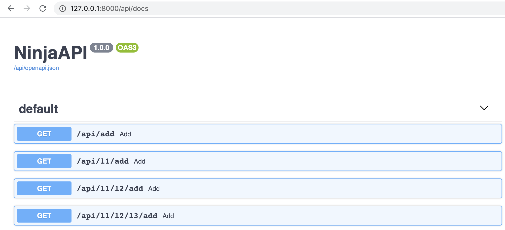

# Routers

Real world applications can almost never fit all logic into a single file. 

**Django Ninja** comes with an easy way to split your API into multiple modules using Routers.

Let's say you have a Django project with a structure like this:


```
├── myproject
│   └── settings.py
├── events/
│   ├── __init__.py
│   └── models.py
├── news/
│   ├── __init__.py
│   └── models.py
├── blogs/
│   ├── __init__.py
│   └── models.py
└── manage.py
```

To add API's to each of the Django applications, create an `api.py` module in each app:

``` hl_lines="5 9 13"
├── myproject
│   └── settings.py
├── events/
│   ├── __init__.py
│   ├── api.py
│   └── models.py
├── news/
│   ├── __init__.py
│   ├── api.py
│   └── models.py
├── blogs/
│   ├── __init__.py
│   ├── api.py
│   └── models.py
└── manage.py
```

Now let's add a few operations to `events/api.py`. The trick is that instead of using the `NinjaAPI` class, you use the **Router** class:

```python  hl_lines="1 4 6 13"
from ninja import Router
from .models import Event

router = Router()

@router.get('/')
def list_events(request):
    return [
        {"id": e.id, "title": e.title}
        for e in Event.objects.all()
    ]

@router.get('/{event_id}')
def event_details(request, event_id: int):
    event = Event.objects.get(id=event_id)
    return {"title": event.title, "details": event.details}
```

Then do the same for the `news` app with `news/api.py`:

```python  hl_lines="1 4"
from ninja import Router
from .models import News

router = Router()

@router.get('/')
def list_news(request):
    ...

@router.get('/{news_id}')
def news_details(request, news_id: int):
    ...
```
and then also `blogs/api.py`.


Finally, let's group them together.
In your top level project folder (next to `urls.py`), create another `api.py` file with the main `NinjaAPI` instance:

``` hl_lines="2"
├── myproject
│   ├── api.py
│   └── settings.py
├── events/
│   ...
├── news/
│   ...
├── blogs/
│   ...

```

It should look like this:

```python
from ninja import NinjaAPI

api = NinjaAPI()

```

Now we import all the routers from the various apps, and include them into the main API instance:

```python hl_lines="2 6 7 8"
from ninja import NinjaAPI
from events.api import router as events_router

api = NinjaAPI()

api.add_router("/events/", events_router)    # You can add a router as an object
api.add_router("/news/", "news.api.router")  #   or by Python path
api.add_router("/blogs/", "blogs.api.router")
```

Now, include `api` to your urls as usual and open your browser at `/api/docs`, and you should see all your routers combined into a single API:


## Router authentication

Use `auth` argument to apply authenticator to all operations declared by router:

```python
api.add_router("/events/", events_router, auth=BasicAuth())
```

or using router constructor
```python
router = Router(auth=BasicAuth())
```

## Router tags

You can use `tags` argument to apply tags to all operations declared by router:

```python
api.add_router("/events/", events_router, tags=["events"])
```

or using router constructor
```python
router = Router(tags=["events"])
```


## Nested routers

There are also times when you need to split your logic up even more.
**Django Ninja** makes it possible to include a router into another router as many times as you like, and finally include the top level router into the main `api` instance.


Basically, what that means is that you have `add_router` both on the `api` instance and on the `router` instance:


```python hl_lines="7 8 9 32 33 34"
from django.contrib import admin
from django.urls import path
from ninja import NinjaAPI, Router

api = NinjaAPI()

first_router = Router()
second_router = Router()
third_router = Router()


@api.get("/add")
def add(request, a: int, b: int):
    return {"result": a + b}


@first_router.get("/add")
def add(request, a: int, b: int):
    return {"result": a + b}


@second_router.get("/add")
def add(request, a: int, b: int):
    return {"result": a + b}


@third_router.get("/add")
def add(request, a: int, b: int):
    return {"result": a + b}


second_router.add_router("l3", third_router)
first_router.add_router("l2", second_router)
api.add_router("l1", first_router)

urlpatterns = [
    path("admin/", admin.site.urls),
    path("api/", api.urls),
]
```

Now you have the following endpoints:

```
/api/add
/api/l1/add
/api/l1/l2/add
/api/l1/l2/l3/add
```

Great! Now go have a look at the automatically generated docs:



### Nested url parameters

You can also use url parameters in nested routers by adding `= Path(...)` to the function parameters:

```python hl_lines="13 16"
from django.contrib import admin
from django.urls import path
from ninja import NinjaAPI, Path, Router

api = NinjaAPI()
router = Router()

@api.get("/add/{a}/{b}")
def add(request, a: int, b: int):
    return {"result": a + b}

@router.get("/multiply/{c}")
def multiply(request, c: int, a: int = Path(...), b: int = Path(...)):
    return {"result": (a + b) * c}

api.add_router("add/{a}/{b}", router)

urlpatterns = [
    path("admin/", admin.site.urls),
    path("api/", api.urls),
]
```

This will generate the following endpoints:

```
/api/add/{a}/{b}
/api/add/{a}/{b}/multiply/{c}
```