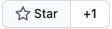

# Help / Get Help

## Do you like Django Ninja ?

If you do like this project - there is a tiny thing you can do to let us know that we are moving in the right direction.

Simply give django-ninja a <a href="https://github.com/vitalik/django-ninja" target="_blank">star on github</a> <a href="https://github.com/vitalik/django-ninja" target="_blank"></a>

OR share this url on social media: 
```
http://django-ninja.rest-framework.com
```

## Do you want to help us?

You can inspect our docs for typos and spelling mistakes - and create pull requests or <a href="https://github.com/vitalik/django-ninja/issues" target="_blank">open an issue</a>

Also you can put to issues suggestions to improve **django ninja**

Pull requests are always welcome.

## Do you need help?

Do not hesitate - go to <a href="https://github.com/vitalik/django-ninja/issues" target="_blank">github issues</a> and create your question or describe a problem. Will try to address quickly.


