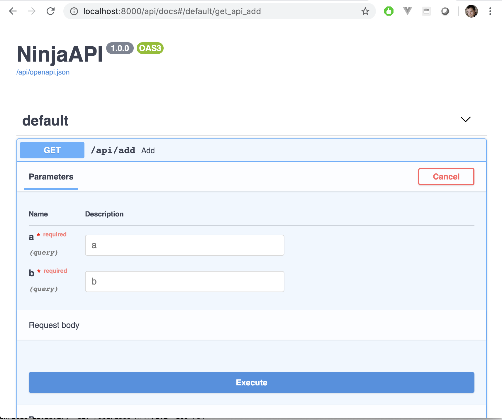

# Quick Start

In three short pages you'll build a small **events API**: people can browse events, filter and paginate them, sign in, and register for one. Along the way you'll see most of what makes Django Ninja pleasant to use: type hints that validate input, schemas generated from your models, interactive docs, auth, and routers.

This guide assumes you already know Django: projects, apps, models and migrations. It won't explain those; it only shows the Django Ninja parts.

| Page | What you'll do |
| --- | --- |
| **1. First API** (this page) | Install, create an API, write an endpoint, open the interactive docs |
| **2. [Models & Schemas](models-and-schemas.md)** | Full CRUD for an `Event` model, plus pagination and filtering |
| **3. [Auth, Routers & Next Steps](next-steps.md)** | Split the API into a router, require login, let users register for events |

## Install

=== "pip"

    ```console
    pip install django-ninja
    ```

=== "uv"

    ```console
    uv add django-ninja
    ```

Django Ninja works with any Django project. If you don't have one yet, create a project and an app for the rest of this guide:

```console
django-admin startproject mysite .
python manage.py startapp events
```

Add `"events"` to `INSTALLED_APPS`. Django Ninja itself doesn't need to be in `INSTALLED_APPS`, but adding `"ninja"` lets Django's `runserver` and `collectstatic` serve the interactive docs' assets locally instead of from a CDN.

## Create the API

An API starts with a `NinjaAPI` instance. Create `mysite/api.py` next to `urls.py`:

```python title="mysite/api.py"
from ninja import NinjaAPI

api = NinjaAPI()


@api.get("/hello")
def hello(request, name: str = "world"):
    return {"message": f"Hello, {name}!"}
```

Then mount it in `urls.py`, like any other set of views:

```python title="mysite/urls.py" hl_lines="4 8"
from django.contrib import admin
from django.urls import path

from .api import api

urlpatterns = [
    path("admin/", admin.site.urls),
    path("api/", api.urls),
]
```

Run the server:

```console
python manage.py runserver
```

and open <http://127.0.0.1:8000/api/hello?name=Ninja>:

```json
{"message": "Hello, Ninja!"}
```

A few things happened with no extra code:

- `@api.get("/hello")` registered a `GET` endpoint at `/api/hello`.
- The `request` argument is a regular Django `HttpRequest`, so `request.user`, sessions and middleware all work as usual.
- `name: str = "world"` became an **optional query parameter** with a default value.
- The returned `dict` was serialized to JSON.

## Type hints are validation

Every argument's type hint says what the endpoint accepts. Add an endpoint with two required integers:

```python title="mysite/api.py"
@api.get("/add")
def add(request, a: int, b: int):
    return {"result": a + b}
```

`/api/add?a=2&b=3` returns `{"result": 5}`, and `a` and `b` arrive in your function as real `int`s, not strings. Invalid input never reaches your code. Try `/api/add?a=2&b=three`:

```json
{
    "detail": [
        {
            "type": "int_parsing",
            "loc": ["query", "b"],
            "msg": "Input should be a valid integer, unable to parse string as an integer"
        }
    ]
}
```

The response has status code `422`, and the error points to exactly which parameter failed and why. The same works for `float`, `bool`, `date`, `datetime`, `UUID`, enums, and more. See [Query Parameters](../guide/query-params.md) for the full list.

## Interactive docs

Now open <http://127.0.0.1:8000/api/docs>:



Django Ninja generates an [OpenAPI](https://swagger.io/specification/) schema from your code, including parameter types, required fields and responses, and serves it with Swagger UI. Click an endpoint, then **Try it out** to call it from the browser. The raw schema is at `/api/openapi.json`, ready for client generators and API tools.

The docs are never out of date, because they are built from the same type hints that validate your requests. See [OpenAPI & Interactive Docs](../guide/openapi.md) to customize them.

## Next

So far the API only returns hand-built dicts. Next, connect it to a Django model and build a real CRUD API: [Models & Schemas](models-and-schemas.md).
