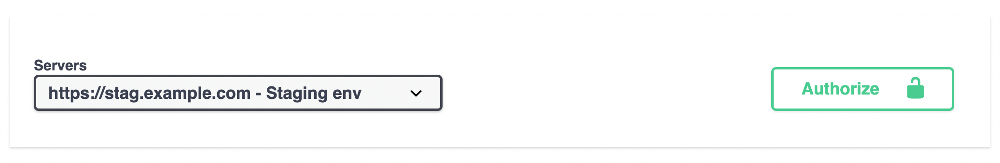

# Operations parameters

## OpenAPI Schema related

The following parameters interact with how the OpenAPI schema (and docs) are generated.

### `tags`

You can group your API operations using the `tags` argument (`list[str]`). 
```python hl_lines="6"
@api.get("/hello/")
def hello(request, name: str):
    return {"hello": name}


@api.post("/orders/", tags=["orders"])
def create_order(request, order: Order):
    return {"success": True}
```

Tagged operations may be handled differently by various tools and libraries. For example, the Swagger UI uses tags to group the displayed operations.


#### Router tags

You can use `tags` argument to apply tags to all operations declared by router:

```python
api.add_router("/events/", events_router, tags=["events"])

# or using constructor: 

router = Router(tags=["events"])
```


### `summary`

A human-readable name for your operation.

By default, it's generated by capitalizing your operation function name:

```python hl_lines="2"
@api.get("/hello/")
def hello(request, name: str):
    return {"hello": name}
```


If you want to override it or translate it to other language, use the `summary` argument in the `api` decorator.

```python hl_lines="1"
@api.get("/hello/", summary="Say Hello")
def hello(request, name: str):
    return {"hello": name}
```


### `description`

To provide more information about your operation, use either the `description` argument or normal Python docstrings:


```python hl_lines="1"
@api.post("/orders/", description="Creates an order and updates stock")
def create_order(request, order: Order):
    return {"success": True}
```


When you need to provide a long multi line description, you can use Python `docstrings` for the function definition:

```python hl_lines="4 5 6 7"
@api.post("/orders/")
def create_order(request, order: Order):
    """
    To create an order please provide:
     - **first_name**
     - **last_name**
     - and **list of Items** *(product + amount)*
    """
    return {"success": True}

```


### `operation_id`

The OpenAPI `operationId` is an optional unique string used to identify an operation. If provided, these IDs must be unique among all operations described in your API.

By default, **Django Ninja** sets it to `module name` + `function name`.

If you want to set it individually for each operation, use the `operation_id` argument:

```python hl_lines="2"
...
@api.post("/tasks", operation_id="create_task")
def new_task(request):
    ...
```

If you want to override global behavior, you can inherit the NinjaAPI instance and override the `get_openapi_operation_id` method.

It will be called for each operation that you defined, so you can set your custom naming logic like this:

```python hl_lines="5 6 7 9"
from ninja import NinjaAPI

class MySuperApi(NinjaAPI):

    def get_openapi_operation_id(self, operation):
        # here you can access operation ( .path , .view_func, etc) 
        return ...

api = MySuperApi()

@api.get(...)
...
```

### `deprecated`

Mark an operation as deprecated without removing it by using the `deprecated` argument:

```python hl_lines="1"
@api.post("/make-order/", deprecated=True)
def some_old_method(request, order: str):
    return {"success": True}
```

It will be marked as deprecated in the JSON Schema and also in the interactive OpenAPI docs:


### `include_in_schema`

If you need to include/exclude some operation from OpenAPI schema use `include_in_schema` argument:

```python hl_lines="1"
@api.post("/hidden", include_in_schema=False)
def some_hidden_operation(request):
    pass
```

## openapi_extra
You can customize your OpenAPI schema for specific endpoint (detail [OpenAPI Customize Options](https://swagger.io/docs/specification/about/))
```python hl_lines="1 26"
# You can set requestBody from openapi_extra
@api.get(
    "/tasks",
    openapi_extra={
        "requestBody": {
            "content": {
                "application/json": {
                    "schema": {
                        "required": ["email"],
                        "type": "object",
                        "properties": {
                            "name": {"type": "string"},
                            "phone": {"type": "number"},
                            "email": {"type": "string"},
                        },
                    }
                }
            },
            "required": True,
        }
    },
)
def some_operation(request):
    pass
    
# You can add additional responses to the automatically generated schema
@api.post(
    "/tasks",
    openapi_extra={
        "responses": {
            400: {
                "description": "Error Response",
            },
            404: {
                "description": "Not Found Response",
            },
        },
    },
)
def some_operation_2(request):
    pass

```


## Response output options

There are a few arguments that lets you tune response's output:

### `by_alias`

Whether field aliases should be used as keys in the response (defaults to `False`).

### `exclude_unset`

Whether fields that were not set when creating the schema, and have their default values, should be excluded from the response (defaults to `False`).

### `exclude_defaults`

Whether fields which are equal to their default values (whether set or otherwise) should be excluded from the response (defaults to `False`).

### `exclude_none`

Whether fields which are equal to `None` should be excluded from the response (defaults to `False`).


## url_name
Allows you to set api endpoint url name (using [django path's naming](https://docs.djangoproject.com/en/stable/topics/http/urls/#reversing-namespaced-urls))
```python hl_lines="1 7"
@api.post("/tasks", url_name='tasks')
def some_operation(request):
    pass

# then you can get the url with

reverse('api-1.0.0:tasks')
```

See the [Reverse Resolution of URLs](../guides/urls.md) guide for more details.


## Specifying servers
If you want to specify single or multiple servers for OpenAPI specification `servers` can be used when initializing NinjaAPI instance:
```python hl_lines="4 5 6 7"
from ninja import NinjaAPI

api = NinjaAPI(
        servers=[
            {"url": "https://stag.example.com", "description": "Staging env"},
            {"url": "https://prod.example.com", "description": "Production env"},
        ]
)
```
This will allow switching between environments when using interactive OpenAPI docs:

