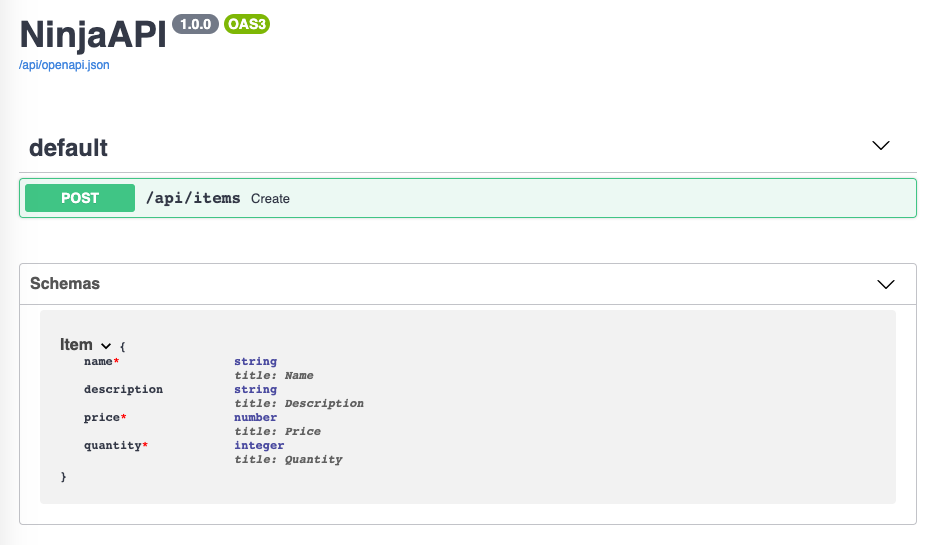
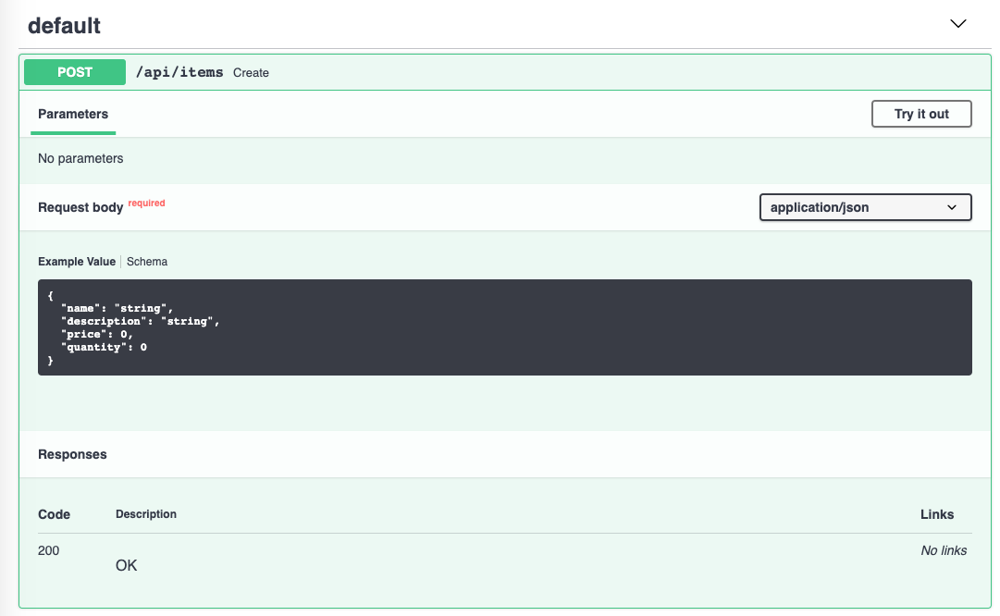
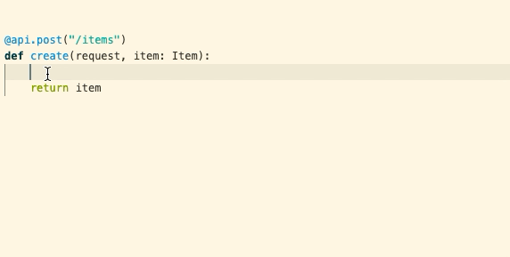

# Request Body

Request bodies are typically used with “create” and “update” operations (POST, PUT, PATCH). For example, when creating a resource using POST or PUT, the request body usually contains the representation of the resource to be created.

To declare a **request body**, you need to use **NinjaAPI `Schema`**.

!!! info
    Under the hood **NinjaAPI** uses <a href="https://pydantic-docs.helpmanual.io/" class="external-link" target="_blank">Pydantic</a> models with all their power and benefits.
    The alias `Schema` was picked to avoid confusion in code with Django models.

## Import Schema

First, you need to import `Schema` from `ninja`:

```Python hl_lines="1"
{!./src/tutorial/body/code01.py!}
```

## Create your data model

Then you declare your data model as a class that inherits from `Schema`.

Use standard Python types for all the attributes:

```Python hl_lines="4 5 6 7 8"
{!./src/tutorial/body/code01.py!}
```

Note: if you use **`None`** as default value for an attribute - it will become optional in the request body.
For example, this model above declares a JSON "`object`" (or Python `dict`) like:

```JSON
{
    "name": "Katana",
    "description": "An optional description",
    "price": 299.00,
    "quantity": 10
}
```

...as `description` is optional (with a default value of `None`), this JSON "`object`" would also be valid:

```JSON
{
    "name": "Katana",
    "price": 299.00,
    "quantity": 10
}
```

## Declare it as a parameter

To add it to your *path operation*, declare it the same way you declared path and query parameters:

```Python hl_lines="12"
{!./src/tutorial/body/code01.py!}
```

...and declare its type as the model you created, `Item`.

## Results

With just that Python type declaration, **NinjaAPI** will:

* Read the body of the request as JSON.
* Convert the corresponding types (if needed).
* Validate the data.
    * If the data is invalid, it will return a nice and clear error, indicating exactly where and what was the incorrect data.
* Give you the received data in the parameter `item`.
    * As you declared it in the function to be of type `Item`, you will also have all the editor support (completion, etc) for all of the attributes and their types.
* Generate <a href="http://json-schema.org" class="external-link" target="_blank">JSON Schema</a> definitions for your model, you can also use them anywhere else you like if it makes sense for your project.
* Those schemas will be part of the generated OpenAPI schema, and used by the automatic documentation <abbr title="User Interfaces">UIs</abbr>.

## Automatic docs

The JSON Schemas of your models will be part of your OpenAPI generated schema, and will be shown in the interactive API docs:



And will be also used in the API docs inside each *path operation* that needs them:



## Editor support

In your editor, inside your function you will get type hints and completion everywhere (this wouldn't happen if you received a `dict` instead of a Schema object):




The previous screenshots were taken with <a href="https://code.visualstudio.com" class="external-link" target="_blank">Visual Studio Code</a>.

But you would get the same editor support with <a href="https://www.jetbrains.com/pycharm/" class="external-link" target="_blank">PyCharm</a> and most of the other Python editors.


## Request body + path parameters

You can declare path parameters **and** body requests at the same time.

**Django Ninja** will recognize that the function parameters that match path parameters should be **taken from the path**, and that function parameters that are declared with `Schema` should be **taken from the request body**.

```Python hl_lines="11 12"
{!./src/tutorial/body/code02.py!}
```

## Request body + path + query parameters

You can also declare **body**, **path** and **query** parameters, all at the same time.

**Django Ninja** will recognize each of them and take the data from the correct place.

```Python hl_lines="11 12"
{!./src/tutorial/body/code03.py!}
```

The function parameters will be recognized as follows:

* If the parameter is also declared in the **path**, it will be used as a path parameter.
* If the parameter is of a **singular type** (like `int`, `float`, `str`, `bool`, etc) it will be interpreted as a **query** parameter.
* If the parameter is declared to be of the type of a **Schema** (or Pydantic `BaseModel`), it will be interpreted as a request **body**.
